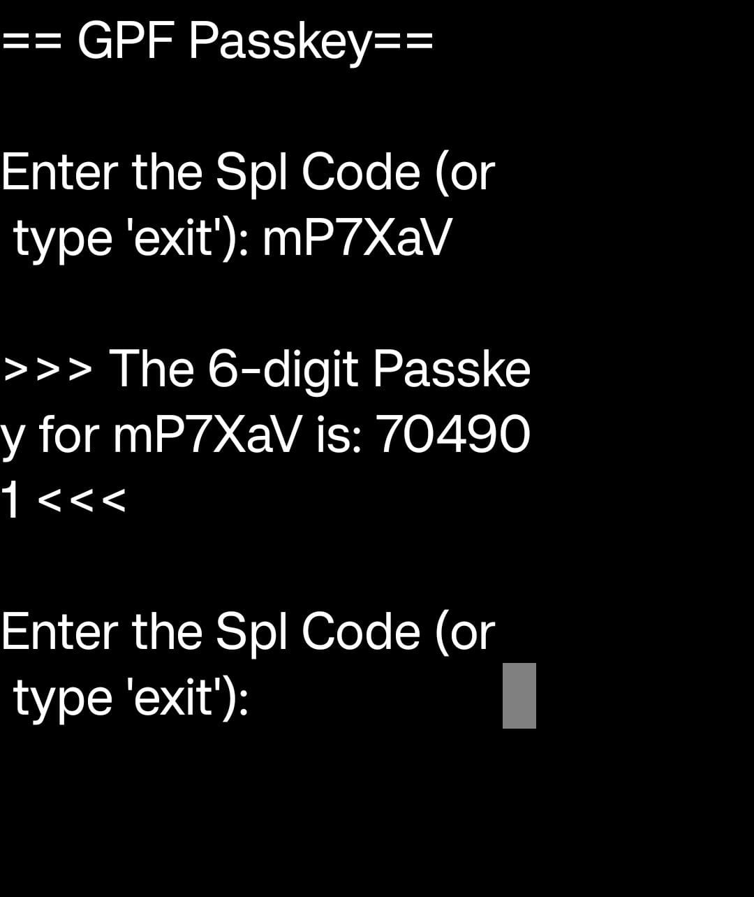
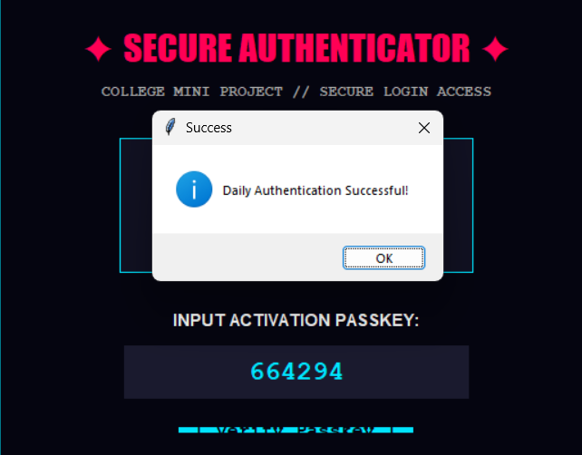
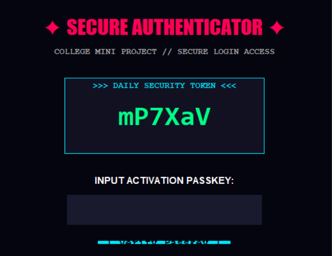

# Secure Authenticator

A desktop-based authentication and licensing application developed in Python using Tkinter.

Secure Authenticator is a college mini-project that demonstrates how authentication and software licensing concepts can be implemented in a Python desktop application using randomly generated security tokens, SHA-256 hashing, daily authentication, and hardware-based permanent activation.

---

## Project Overview

Secure Authenticator provides a simple authentication workflow for a desktop application.

When the application starts, it checks whether:

1. The device has already been permanently activated, or
2. The device has already been authenticated for the current day.

If authentication is required, the application generates a random security token and calculates a six-digit authentication passkey using SHA-256 hashing.

The user must enter the correct passkey to access the main application.

This project is intended primarily for educational and academic purposes. It demonstrates GUI development, file handling, cryptographic hashing, random data generation, hardware identification, and event-driven programming in Python.

---

## Features

- Daily authentication using a dynamically generated security token
- Six-digit authentication passkey generation
- SHA-256 based passkey calculation
- Hardware-based permanent activation
- Predefined master activation keys
- Local license file storage
- Daily authentication status tracking
- Tkinter-based graphical user interface
- Dark-themed user interface
- Keyboard support using the `Enter` key
- Authentication success and failure messages
- Automatic creation of authentication and license files
- No external Python packages required

---

## Technologies Used

| Technology | Purpose |
|---|---|
| Python 3 | Main programming language |
| Tkinter | Graphical user interface |
| hashlib | SHA-256 hashing |
| uuid | Hardware identifier generation |
| datetime | Daily authentication tracking |
| random | Random security token generation |
| string | Character generation |
| os | File and operating system operations |

No external Python packages are required.

---

## Requirements

The project requires:

- Python 3.x
- Tkinter

Tkinter is included with most standard Python installations.

### Check Python Version

python --version

On systems where Python 3 is accessed using `python3`:

python3 --version

---

## Project Structure

Secure-Authenticator/ │ ├── main.py ├── README.md │ ├── screenshots/ │ ├── authentication.jpeg │ ├── authenticationsuccess.png │ └── mainapplication.png │ ├── authstatus.txt └── applicense.lic

The following files are generated automatically by the application:

authstatus.txt applicense.lic

These files do not need to be created manually.

---

## Installation

### 1. Clone the Repository

git clone <YOURGITHUBREPOSITORY_URL>

Navigate to the project directory:

cd Secure-Authenticator

### 2. Run the Application

Run the following command:

python main.py

On some systems, use:

python3 main.py

---

## Application Workflow

The application follows the authentication workflow below:

flowchart TD A[Start Application] --> B{Permanent License Valid?}

B -->|Yes| G[Main Application] B -->|No| C{Authenticated Today?}

C -->|Yes| G C -->|No| D[Generate Security Token]

D --> E[Calculate Six-Digit Passkey] E --> F[Display Authentication Window]

F --> H[User Enters Passkey] H --> I{Passkey Valid?}

I -->|Yes| J[Save Authentication Date] J --> G

I -->|No| K[Access Denied] K --> F

---

## Authentication System

The application provides two authentication mechanisms:

1. Daily Authentication
2. Permanent Device Activation

---

## Daily Authentication

When the application starts, it first checks whether the device has already been authenticated on the current date.

If authentication has not been completed, the application generates a random security token.

The token has a random length between 4 and 8 characters and may contain:

- Uppercase letters
- Lowercase letters
- Numbers
- Special characters

### Example Security Token

A7x@92

The generated security token is combined with the master key and processed using SHA-256.

Security Token + Master Key | v SHA-256 | v Hash Digest | v Six-Digit Passkey

The generated passkey is then used to authenticate the user.

---

## Passkey Generation

The application generates the six-digit passkey using SHA-256 hashing.

The basic logic is:

combineddata = f"{splcode}{secret_key}".encode("utf-8")

hashhex = hashlib.sha256(combineddata).hexdigest()

passkey = str(int(hash_hex[:8], 16) % 1000000).zfill(6)

The generated result is always a six-digit numeric value.

### Calculation Process

Security Token + Master Key | v SHA-256 | v Hash Digest | v First 8 Hex Characters | v Integer Conversion | v Modulo 1,000,000 | v Six-Digit Passkey

---

## Daily Authentication Storage

After successful authentication, the current date is stored in:

auth_status.txt

### Example

2026-10-05

When the application is started again on the same date, it detects the existing authentication status and allows the user to access the main application without performing authentication again.

When the date changes, authentication is required again unless the device has been permanently activated.

---

## Permanent Device Activation

The application also supports permanent device activation through predefined master activation keys.

When a valid master activation key is entered, the application obtains a hardware identifier using:

uuid.getnode()

The activation key and hardware identifier are then combined and hashed using SHA-256.

Master Activation Key + Hardware ID | v SHA-256 | v License Hash | v app_license.lic

The resulting hash is stored in:

app_license.lic

During future application launches, the stored license hash is checked against the device hardware identifier.

If a valid match is found, the device is considered permanently unlocked.

---

## User Interface

The application contains two main interfaces.

### Authentication Window

The authentication window includes:

- Secure Authenticator heading
- Daily security token
- Passkey input field
- Verify Passkey button
- Authentication success messages
- Authentication error messages

The interface uses a dark theme with cyan, green, and red visual indicators.

### Main Application Window

After successful authentication, the main application displays:

COLLEGE MINI PROJECT

Authentication Successful!

Welcome to the main application interface.

[ Exit Application ]

The main application currently acts as a foundation for additional project functionality.

---

## Screenshots

### Authentication Window

The authentication window displays the randomly generated security token and provides a field for entering the authentication passkey.

---

### Authentication Success

After entering the correct passkey, the application displays a successful authentication message.

---

### Main Application

After successful authentication, the main application interface is displayed.

---

## Main Functions

| Function | Description |
|---|---|
| `get_hardware_id()` | Generates a hardware identifier using `uuid.getnode()` |
| `is_permanently_unlocked()` | Checks whether a valid permanent license exists |
| `save_permanent_unlock()` | Creates and stores the permanent license hash |
| `calculate_passkey()` | Generates the six-digit authentication passkey |
| `is_authenticated_today()` | Checks whether authentication was completed today |
| `save_auth_today()` | Saves the current authentication date |
| `run_authentication()` | Controls the authentication process |
| `AuthWindow` | Provides the graphical authentication interface |

---

## Configuration

The main authentication configuration is defined using variables such as:

MASTERKEY = "SECRETKEY_123"

AUTHFILE = "authstatus.txt"

LICENSEFILE = "applicense.lic"

### MASTER_KEY

MASTERKEY = "SECRETKEY_123"

The master key is used during the generation of the daily authentication passkey.

> For a production application, secrets should not be hard-coded directly into the source code.

### AUTH_FILE

AUTHFILE = "authstatus.txt"

This file stores the date of the last successful daily authentication.

Example:

2026-10-05

### LICENSE_FILE

LICENSEFILE = "applicense.lic"

This file stores the hash associated with permanent device activation.

The actual activation key is not directly stored in the license file.

---

## Generated Files

### `auth_status.txt`

This file stores the date of the last successful daily authentication.

Example:

2026-10-05

### `app_license.lic`

This file stores the SHA-256 hash generated from the master activation key and hardware identifier.

The actual activation key is not directly stored in the license file.

---

## Security Considerations

This project is intended for educational purposes and demonstrates basic authentication and cryptographic concepts.

It should not be considered a production-ready authentication system.

The current implementation has several security limitations:

- The master key is hard-coded in the source code.
- Master activation keys are stored directly in the source code.
- Python source code can be inspected or modified.
- The hardware identifier is generated using `uuid.getnode()`.
- Authentication information is stored locally.
- The license file can potentially be deleted or modified.
- There is no server-side authentication.
- System date manipulation can affect daily authentication.
- SHA-256 is used as a deterministic passkey-generation mechanism rather than as a complete authentication protocol.

For a production application, a more secure architecture should be implemented using:

- Protected secrets
- Secure password hashing
- Server-side authentication
- Signed licenses
- Secure key management
- Appropriate access-control mechanisms
- Login attempt protection
- Audit logging

---

## Example

When the application starts, the authentication interface provides a randomly generated security token.

Example:

SECURE AUTHENTICATOR

COLLEGE MINI PROJECT // SECURE LOGIN ACCESS

DAILY SECURITY TOKEN

A7x@92

INPUT ACTIVATION PASSKEY:

[ 482731 ]

[ Verify Passkey ]

After entering the correct authentication key, the application displays:

Daily Authentication Successful!

The user is then granted access to the main application.

---

## Error Handling

If the user enters an incorrect key, the application displays an access-denied message:

Access Denied

Incorrect Key! Please try again.

The input field is then cleared so that the user can enter another key.

If the user closes the authentication window without successfully authenticating, the application exits.

---

## Keyboard Support

The authentication interface supports keyboard-based submission.

After entering the passkey, the user can press:

Enter

instead of clicking the Verify Passkey button.

---

## Future Improvements

The project can be extended with the following features:

- Username and password authentication
- Database integration
- Server-based authentication
- Secure password hashing
- Administrator dashboard
- Login activity logging
- License expiration
- Digitally signed license files
- Failed-login protection
- Email verification
- Password reset functionality
- Automated unit testing
- Improved secret management
- Windows executable packaging
- Additional application functionality
- Application settings
- User management
- Authentication history
- Improved user interface

---

## Academic Purpose

This project demonstrates several Python programming concepts, including:

- Object-oriented programming
- GUI development
- Event-driven programming
- File handling
- Exception handling
- Random data generation
- Cryptographic hashing
- Hardware identification
- Authentication logic
- Conditional programming

The project is suitable for a college mini-project demonstrating Python GUI development and basic authentication concepts.

---

## Advantages

- Simple and easy-to-use graphical interface
- No external dependencies
- Lightweight desktop application
- Daily authentication mechanism
- Permanent device activation support
- SHA-256 based passkey calculation
- Easy to understand for educational purposes
- Can be extended with additional application features
- Automatic authentication and license file creation

---

## Limitations

- Authentication data is stored locally.
- The master key is present in the source code.
- Activation keys are present in the source code.
- There is no centralized authentication server.
- The license system is device-dependent.
- Local files can potentially be modified or deleted.
- System date manipulation can affect daily authentication.
- The current main application contains limited functionality.
- The security mechanism is intended for demonstration rather than production use.

---

## Project Information

| Property | Details |
|---|---|
| Project Name | Secure Authenticator |
| Programming Language | Python |
| GUI Framework | Tkinter |
| Authentication | SHA-256 Based |
| Application Type | Desktop Application |
| Project Type | College Mini Project |
| External Dependencies | None |
| License | Educational Use |

---

## How It Works

The complete authentication process can be summarized as:

Application Start | v Check Permanent License | +------------------- Valid -------------------> Main Application | v Check Today's Authentication | +------------------- Valid -------------------> Main Application | v Generate Random Security Token | v Combine Token + Master Key | v Calculate SHA-256 Hash | v Generate Six-Digit Passkey | v Display Authentication Window | v User Enters Passkey | +------------------- Correct -----------------> Save Authentication Date | | | v | Main Application | +------------------- Incorrect ---------------> Access Denied

---

## Important Note

Secure Authenticator is a college and educational mini-project created to demonstrate authentication and licensing concepts using Python.

The implementation should not be used as-is for protecting sensitive data, commercial software, financial applications, or production authentication systems.

For production use, a secure server-side architecture and proper secret-management system should be implemented.

---

## License

This project is intended for educational and academic purposes.

The source code may be modified and extended for:

- Learning
- Experimentation
- Academic projects
- College demonstrations
- Personal educational use

---

## Conclusion

Secure Authenticator demonstrates how Python and Tkinter can be used to create a desktop authentication and licensing system.

The project combines:

- GUI development
- Random token generation
- SHA-256 hashing
- Local file handling
- Hardware identification
- Daily authentication
- Permanent device activation
- Authentication logic

into a single lightweight desktop application.

It provides a useful foundation for developing more advanced authentication and licensing applications in the future.

---

## Project Highlights

Secure Authentication Random Security Token Six-Digit Passkey SHA-256 Hashing Daily Authentication Hardware-Based Activation Local License Storage Tkinter GUI Keyboard Support Educational Mini-Project

---

## Thank You

Thank you for checking out Secure Authenticator.

The project can be explored, modified, and extended to learn more about Python desktop application development, GUI programming, authentication concepts, and software licensing.
